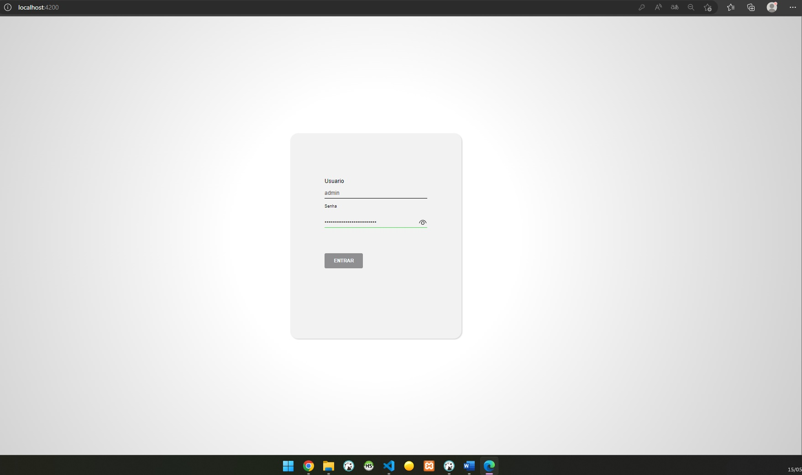
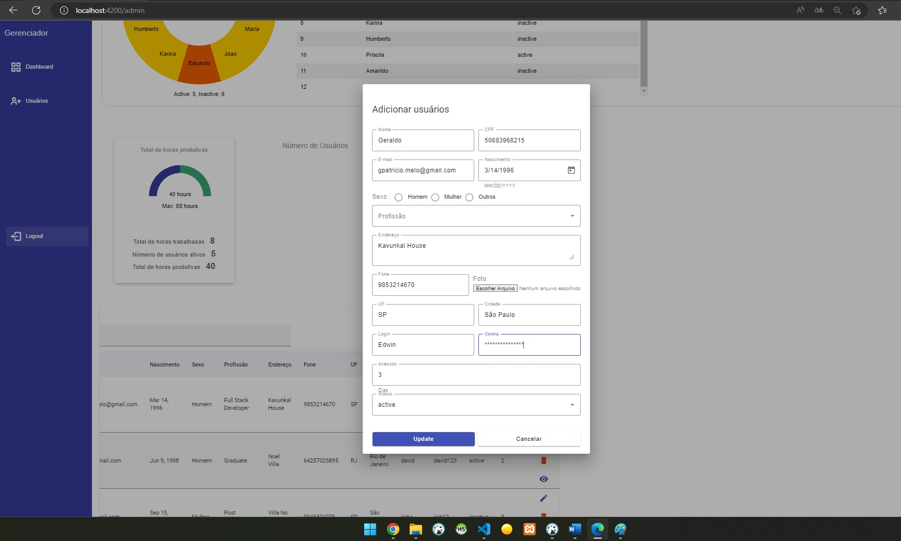

<p align="center">
  
</p>


## Objetivo
```bash
Aplicação de Acesso de Usuários com gerenciamento da tabela de usuários e Dashboard com 
graficos analíticos e estatísticos usando banco de Dados JSON.

```

## Passos para instalação e uso do app:
```bash
1 - Faça o clone do repositório
2 - instale a aplicação
3 - rode o servidor json
4 - rode a aplicação


Git clone Link_deste_repositório
npm i 
npx json-server --watch db.json --port 3000
npm start
```

## Aplicação rodando:
<p align="center">
  
</p>
<p align="center">
  
</p>
<p align="center">
  
</p>
<p align="center">
  
</p>
